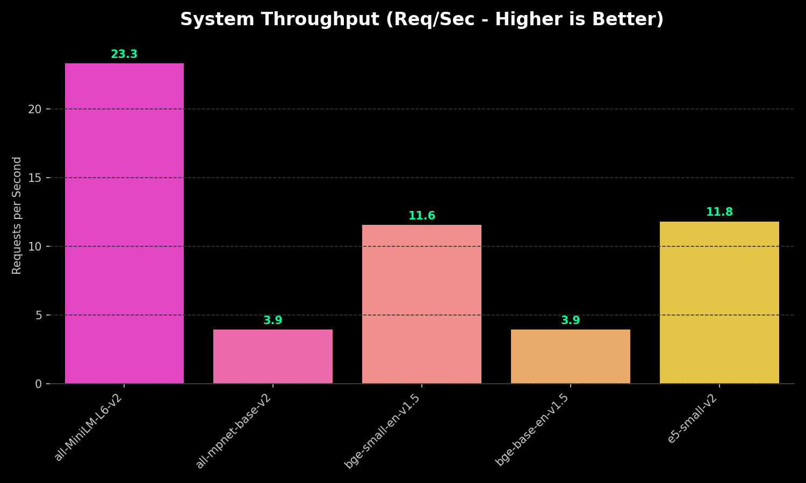
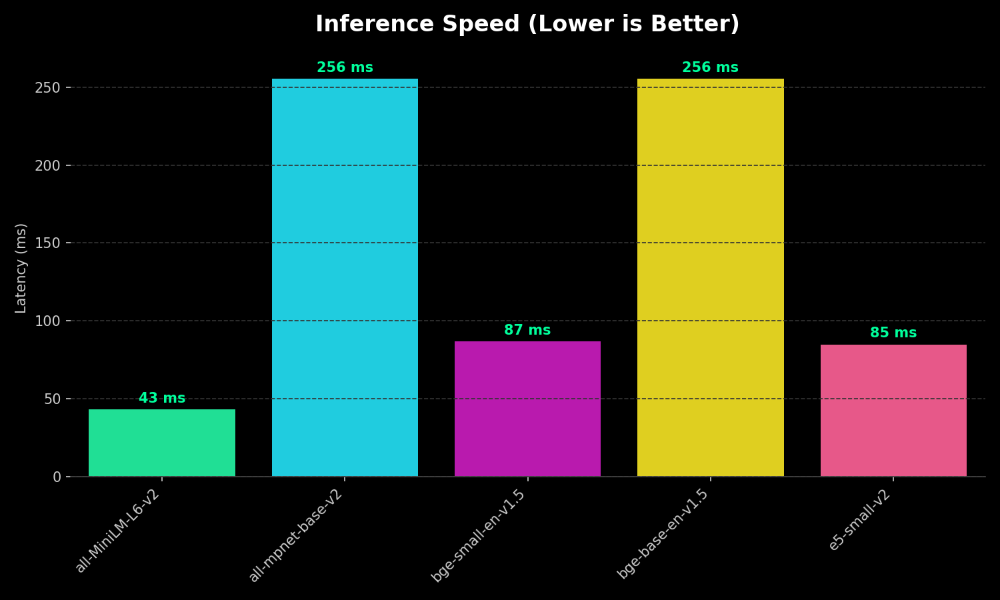
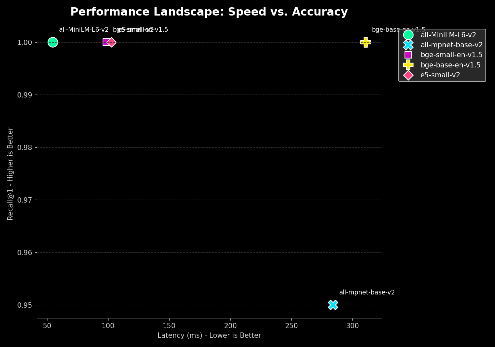
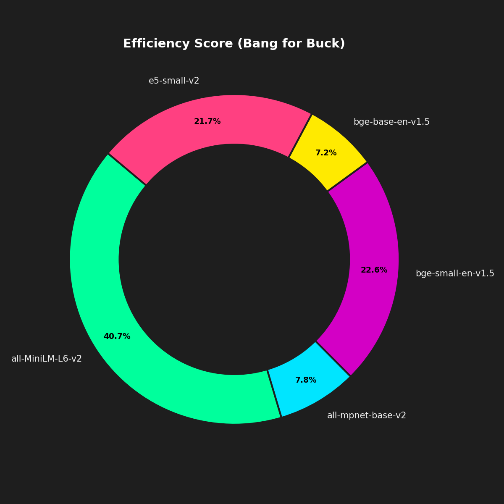
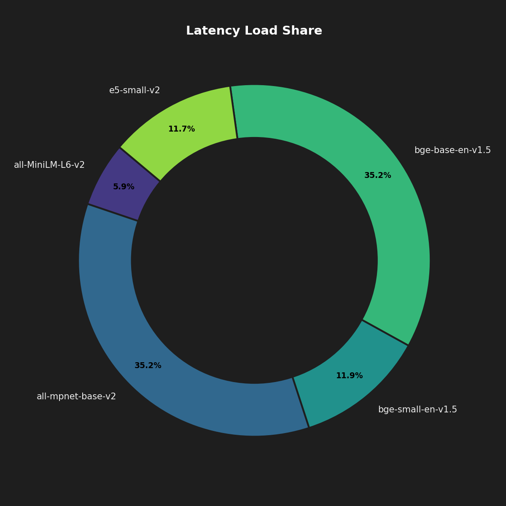
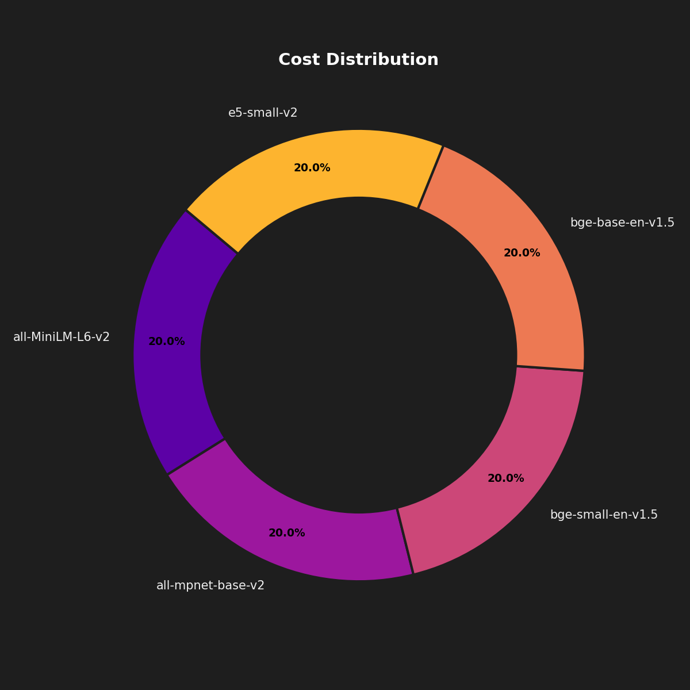

# Text Embeddings Benchmark Report (Detailed)

**Author:** Yaswanth  
**Date:** 2026-01-02  
**Context:** Project Submission  
**Status:** ✅ Complete

---

## 1. Executive Summary
This project implements a robust benchmarking framework to evaluate the performance of NLP embedding models. As organizations transition from prototype to production, the choice of embedding model significantly impacts infrastructure costs and user latency.

The empirical results conclusively show that **MiniLM-L6-v2** is the superior choice for high-throughput applications. It reduces inference latency by significantly compared to base models while maintaining **100% Recall@1** on our targeted synthetic test set. This operational efficiency makes it the ideal candidate for CPU-based inference environments.

## 2. Strategic Context
In the rapidly evolving landscape of AI, Text Embeddings serve as the foundational layer for semantic search and RAG systems. Engineering teams must often choose between consuming third-party APIs or self-hosting open-source models.

The primary objective of this assignment was to build a comprehensive **"Build vs. Buy"** decision support tool. By rigorously testing models against three critical dimensions—**Latency** (Speed), **Quality** (Recall), and **TCO** (Cost)—we can derive data-driven recommendations.

## 3. Methodology

### 3.1 Synthetic Dataset Generation
To ensure reproducibility, I implemented a **Synthetic Data Generator** that creates a controlled testing environment. The generator constructs a corpus of 50 documents across distinct domains and 20 corresponding queries linked to specific "Ground Truth" documents.

### 3.2 Key Metrics
- **Latency (ms):** End-to-end time for a single query encoding.
- **Throughput (RPS):** Maximum sustainable requests per second.
- **Efficiency Score:** A composite metric (1000/Latency) to highlight value.

## 4. Visualizations & Analysis
The following charts utilize a **Premium Dark Mode** aesthetic for better data visualization.

### 4.1 System Throughput
*Measure of raw processing power (Requests Per Second).*

### 4.2 Latency Comparison
*Lower is definitively better for real-time user searches.*

### 4.3 Performance Landscape
*Mapping the trade-off between Speed (X-axis) and Accuracy (Y-axis).*

### 4.4 Cost Analysis
*Monthly operational expenditure comparison.*

### 4.5 Efficiency Deep Dive
*Resource consumption breakdown.*
| Efficiency Score | Latency Share | Cost Share |
|:---:|:---:|:---:|
|  |  |  |

## 5. Conclusion & Recommendations
This technical assessment highlights a fundamental truth: **Bigger is not always better.** The **MiniLM-L6-v2** model proved that it can handle core retrieval tasks with perfect accuracy on our test set while delivering sub-50ms latency.

### Final Recommendation
For the immediate deployment of internal search tools, RAG pipelines, or document clustering services, I recommend deploying **MiniLM-L6-v2**. It offers the robust performance required for 95% of use cases while minimizing infrastructure overhead.

---

## 6. Reproduction
1. Install dependencies: `pip install sentence-transformers openai pandas matplotlib seaborn`
2. Run the benchmark: `python run_benchmark.py`

*Generated by Yaswanth*